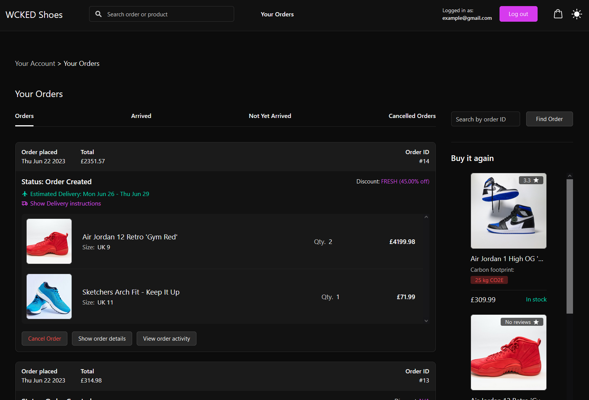
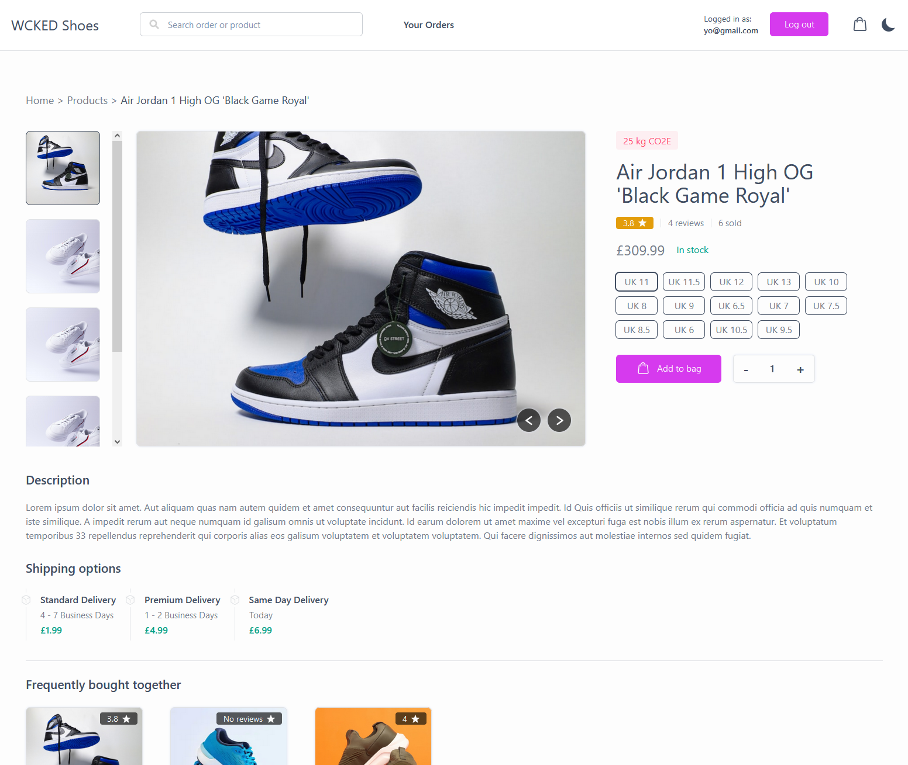

# WCKED Shoes

## A fully functional E-Commerce app written in React (with Typescript) and Flask that offers a variety of useful features to customers such as
## intelligent product recommendations, creating and reading helpful reviews, managing orders, and much more.

This project was partly inspired by Amazon's item-to-item collaborative filtering algorithm that recommends to users what 'customers who bought this item
also bought'. You can read more about this algorithm and how it works <a href="https://www.cs.umd.edu/~samir/498/Amazon-Recommendations.pdf">Here</a> if
you are interested.

## Setting up the project locally

To install this project locally on your machine is pretty quick and straightforward:

1. clone this project
2. cd into the 'client' folder and run 'npm install' to install necessary dependencies.
3. cd into the 'server' folder and run 'pip install -r requirements.txt'. This will install all python modules in the 'requirements.txt' file.
4. create a '.env' file in the 'server' folder and add all of the required variables. These can be found in the 'env_sample.txt' file.

## Running the project locally

1. cd into the 'server' folder and run 'python wsgi.py'. This will spin up the Gunicorn WSGI server (you can configure the server in the wsgi.py file).
2. go to the 'package.json' file in the 'client' folder and add a proxy that points to the URL of the WSGI server (http://{IP Address}:{PORT}).

3. #### Example of configuring the proxy with WSGI server located at: http://0.0.0.0:8080

4. run the command 'npm start' in the 'client' folder and open the app in any browser.

## Find a bug?

If you found an issue or would like to contribute to this project, please raise an issue first before making a pull request. When you submit a PR, reference the issue you created so I know what you fixed.